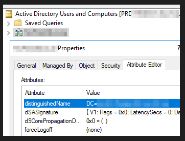

# Extra a list of AD User Accounts that have not change their passwords

PowerShell script to get list of dormant/risk AD User Accounts not logged on since set date.

Provide a date since before password for user accounts in Active Directory was last set.

Obtain the search base Distinguished name field "distinguishedName", value from active directory, using attribute editor in Active Directory Users and Computers MMC.

