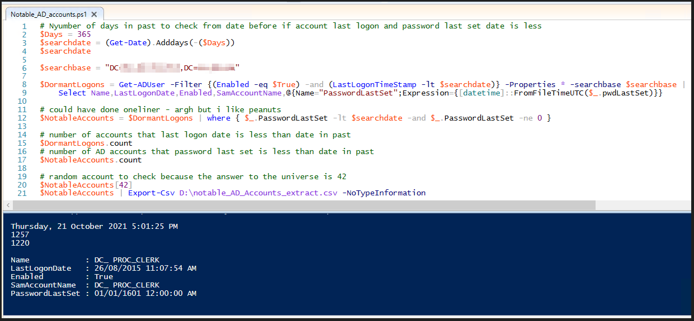

# Notable Active Directory Accounts

>Purpose of these PowerShell Scripts:
1. Password Spray single password against list of usernames.
2. Extract a list of notable AD User Accounts that have not change their passwords and did not logon since given date. - Dormant
3. List all possible accounts with SPN values kerberoastable from Active Directory.

----  

## Password Spray 
These accounts are a security risk to an organization, as their passwords may not comply to latest domain password policy and has been dormant.
Malicious actors finding these accounts can use it to gain read access to Active Directory through method such as a password spray attack using crackmapexec.

```bash
nxc -t 1 smb domaincontroller.domain.internal -u userlist.txt -p password --continue-on-success
```

>Above is nxc command to spray the password of password using list of possible active directory user accounts.

## Notable Dormant AD Users  

>Provide a number of days to calculate a date since before password for user accounts in Active Directory was last changed and when last account logged on.

>Obtain the search base Distinguished name field "distinguishedName", value from active directory, using attribute editor in Active Directory Users and Computers MMC.


Sample output from the PowerShell Script with random user account last logon date and last password set date to verify.



This can be used during redteam or penetration test security assessment.

## Kerberoasting  

```powershell
get-kerberoastable-user-info.ps1
Get-Content C:\temp\KerberoastingVulnerableAccounts.csv
```
