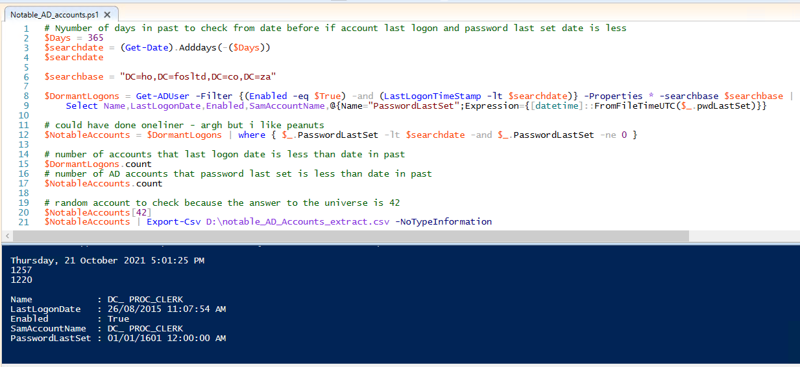

# Notable Active Directory Accounts

Purpose of this PowerShell Script is to Extract a list of notable AD User Accounts that have not change their passwords and did not logon

These accounts is security risk to the organization, as their passwords may not comply to latest domain password policy and is dormant.
Malicious actors finding these accounts can use it to gain read access to Active Directory through method such as password spray using crackmapexec.

```bash
crackmapexec -t 1 smb domaincontroller.domain.internal -u userlist.txt -p password --continue-on-success
```
Above is crackmapexec command to spray the password of password using list of possible active directory user accounts.

Provide a date since before password for user accounts in Active Directory was last set.

Obtain the search base Distinguished name field "distinguishedName", value from active directory, using attribute editor in Active Directory Users and Computers MMC.


Sample output from the PowerShell Script with random user account last logon date and last password set date to verify.


